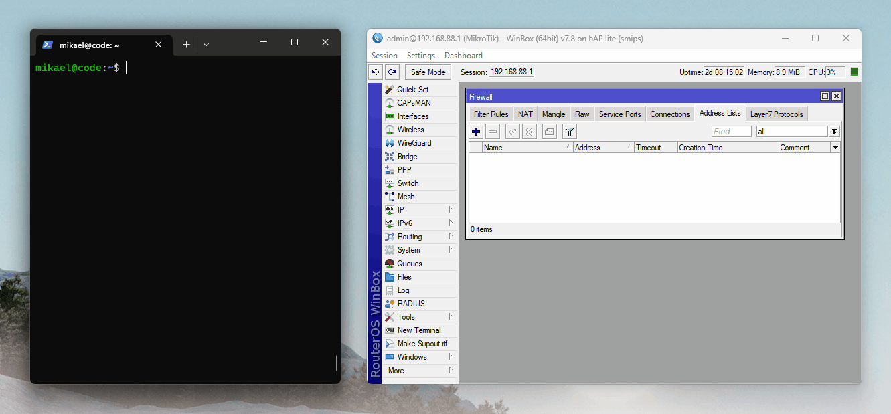
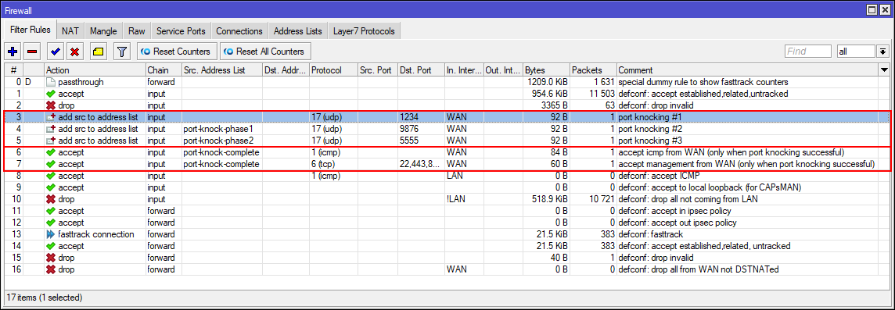
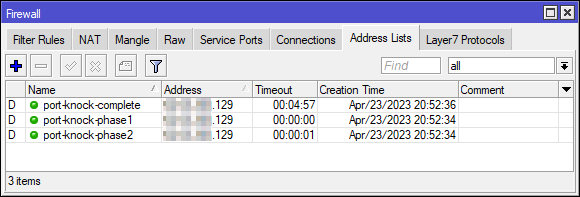

# spknock - The Secret Port Knocker
The concept of port knocking allow you to have ports that are closed in a firewall until a specific sequence of packets are received. Once the correct sequence of packets are received the firewall opens up the ports of your liking for a specific amount of time. 

The **spknock** script is a port knocker script with a twist for some added security. It uses a hashed password inside each packet which must also match in order for the port knock to succeed.



## Introduction
In short there is **regular port knocking** which utilizes TCP (SYN) or UDP packets to knock; and there is the **secret port knocker** that sends UDP packets with a hashed passphrases as encapsulated data.

As an example, let's assume that we want to be able to SSH into our firewall from the internet. We must then add a rule in the firewall accepting TCP traffic on port 22 (by default). This is a bad idea since it lets an attacker perform a simple port scan to find that there is a system to attack.

> In the two examples below I use **three** (3) knocks but you can use *any number of knocks* as per your preference.

### Regular Port Knocker
In this example TCP port 22 is closed until you send three packets to the firewall on the TCP ports 1234, 9876 and 5555, after which TCP port 22 is temporarily opened up for you.

1. Your connections to TCP port 22 are *dropped* by the firewall.
2. You send a packet to TCP port 1234, which is *dropped*. **And**, your source IP is added to an address list `port-knock-phase1` since your *first knock* was correct.
3. You send a second packet to TCP port 9876, which is *dropped*. **And**, if your source IP exists in the address list `port-knock-phase1`, we also add your source IP to another address list `port-knock-phase2` since **both** your *first and second knock* was correct.
4. You send a third packet to TCP port 5555, which is *dropped*. **And**, if your source IP exists in the address list `port-knock-phase2`, we also add our source IP to another address list `port-knock-complete` since *all of your knocks* are correct.
5. Now, since your source IP can be found in the `port-knock-complete` address list we are allowed to connect to TCP port 22!

Once your source IP address is placed in an address list there is also a timeout involved. So, after a given amount of time (let's say 5 minutes) your source IP is removed from the address list and you have to do a knock for a new connection. Since it's a stateful firewall, connections that are already established will remain established until closed or reset.

>A problem with this solution is that it's quite easy to do a port scan from port 1-65536, then a new scan from 1-65535 and lastly another scan from 1-65535 and port 22 is now open!

### Secret Port Knocker
As previously mentioned the secret port knocker adds another layer of security, which makes it a bit harder to attack your system.

Here you send three packets to the firewall on the UDP port 1234, 9876 and 5555. Inside each of these packets resides a SHA256 hash which the firewall checks agains the firewall rules. In order for your source IP address to be added to the `port-knock-phase1`, `port-knock-phase2` and `port-knock-complete` address lists, you must also *send the correct hash* with each packet.

Note that this approach uses **UDP** and **not TCP**. This is simply because no data can be sent with TCP until the entire three-way handshake is completed; and port knocking with TCP only utilize the first (SYN) packet. We don't want to complete the three-way handshake because that lets the sender know that there is something listening on the port in question.

## Installation

### Python Script
Download `spknock.py` and run it from a terminal:
```bash
mikael@code:~$ python spknock.py
----------------------------------------
          Secret Port Knocker
----------------------------------------
 Loaded 1 port knock target from file.

 Select existing target:
 -----------------------
 [1] Knock on fw.example.com

 Select option:
 -----------------------
 [A] Add new target
 [H] Generate SHA256 hash
 [X] Exit

 Choice:
```
You are presented with a simple user interface that allow you to:
* Add target machines
* Generate passphrase hashes
* Perform port knocking on saved targets

Port knock targets (hosts that you wish to perform port knocking on) are stored in a file inside your home directory:
```bash
mikael@code:~$ cat ~/.secrets/spknock-targets.conf
fw.example.com:1234/udp,9876/udp,5555/udp
```

### Generate Hashes
Before installing the firewall rules we need some hashes. These are the hashed passphrases that you will need to enter everytime you perform a port knock sequence against your firewall.

Press `H` and hit ENTER inside the running script.

Enter a passphrase. In the example below I enter `MikroTik` as a passphrase:
```bash
Generate SHA256 hash
--------------------
 Enter passphrase:
 Hash: 862b6133b45f398cf96d13429629edfc02dbc102d8108441436ced70651c7aad

Press <Enter> to continue...
```
If you are going to use three knocks, create three hashes, preferrably different for each knock.

### Create Firewall Rules
In this example I'm using a firewall from **MikroTik**, simply because *they are awesome*!

But, this should be possible to configure on any `iptables`/`nftables` firewall as well (maybe other hardware firewalls as well?).

```bash
/ip firewall filter
# Add the first knock rule
add action=add-src-to-address-list address-list=port-knock-phase1 address-list-timeout=5s \
    chain=input comment="port knocking #1" content=862b6133b45f398cf96d13429629edfc02dbc102d8108441436ced70651c7aad \
    dst-port=1234 in-interface-list=WAN protocol=udp

# Add the second knock rule
add action=add-src-to-address-list address-list=port-knock-phase2 address-list-timeout=5s \
    chain=input comment="port knocking #2" content=fa51fd49abf67705d6a35d18218c115ff5633aec1f9ebfdc9d5d4956416f57f6 \
    dst-port=9876 in-interface-list=WAN protocol=udp src-address-list=port-knock-phase1

# Add the third knock rule
add action=add-src-to-address-list address-list=port-knock-complete address-list-timeout=5m \
    chain=input comment="port knocking #3" content=705db0603fd5431451dab1171b964b4bd575e2230f40f4c300d70df6e65f5f1c \
    dst-port=5555 in-interface-list=WAN log=yes log-prefix=port-knock protocol=udp src-address-list=port-knock-phase2

# Add a rule allowing ICMP from IP addresses that have successfully completed the port knocking sequence
add action=accept chain=input comment="accept icmp from WAN (only when port knocking successful)" \
    in-interface-list=WAN protocol=icmp src-address-list=port-knock-complete

# Add a rule allowing SSH and WinBox from IP addresses that have successfully completed the port knocking sequence
add action=accept chain=input comment="accept management from WAN (only when port knocking successful)" dst-port=22,443,8291 \
    in-interface-list=WAN protocol=tcp src-address-list=port-knock-complete
```

Don't forget to place the rules before the drop rule in the input chain. The result might look like this on a fresh firewall installation:


**Note**: The three passphrases used in this example are `MikroTik`, `is` and `awesome`. 

### Add Target Machine
Now we need to add the MikroTik firewall as a **knock target** in the script. This is most likely the IPv4 address or FQDN of the WAN interface of your firewall.

Press `A` and hit ENTER to add a new target:
```bash
----------------------------------------
          Secret Port Knocker
----------------------------------------
 
 Select option:
 -----------------------
 [A] Add new target
 [H] Generate SHA256 hash
 [X] Exit

 Choice: a

Add new target host
-------------------
 Hostname or IP     : fw.example.com
 Knock count (1-9)  : 3
 Port number 1      : 1234
 Protocol (tcp/udp) : udp
 Port number 2      : 9876
 Protocol (tcp/udp) : udp
 Port number 3      : 5555
 Protocol (tcp/udp) : udp

Target added and saved to file: /home/mikael/.secrets/spknock-targets.conf

Press <Enter> to continue...
```
Remember that **UDP** is a **requirement** when using a passphrase.

## Testing
It's time to test the port knocker to see it in action. Fire up the script, select your target and start knocking:
```bash
mikael@code:~$ python spknock.py
----------------------------------------
          Secret Port Knocker
----------------------------------------
 Loaded 1 port knock target from file.

 Select existing target:
 -----------------------
 [1] Knock on fw.example.com

 Select option:
 -----------------------
 [A] Add new target
 [H] Generate SHA256 hash
 [X] Exit

 Choice: 1

 Enter passphrase (1234/udp): ********
 Enter passphrase (9876/udp): **
 Enter passphrase (5555/udp): *******

Port knock sequence completed.

mikael@code:~$
```
If you typed the correct passphrases your IP address is now added to the address list called `port-knock-complete`:


If you have done everything correct you should now be able to connect to the target via `SSH`, `HTTPS`, `WinBox` and `ICMP`.

The ports are open for 5 minutes according to the configuration above, but you can tweak the timeouts as you want, just change `address-list-timeout=5m` on the third knock rule.

## Screenshots
There are more screenshots in the `docs/img/` directory for anyone interested.

## Improvements
Future improvements that might get implemented when the time is right:

- [ ] Remove target
- [ ] Run post action. For example a ping/tcping to check that the port knock succeeded.
- [ ] Generate a complete set of firewall rules (like a port knock wizard)